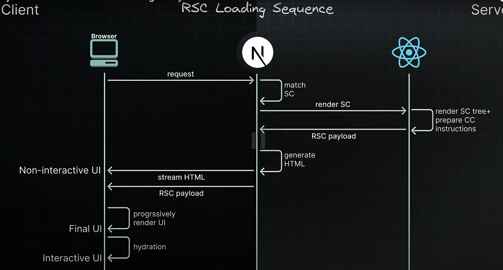
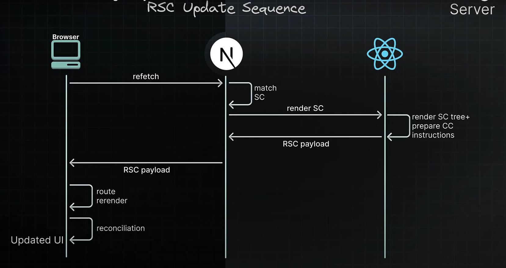

### Lifecycle

3 elements to consider:
- browser(the client)
- Next.js
- React

process of React server components work: 
1. match request **URL** to a server component
2. Next.js instructs react to **render the server component** and any child component that are also server components
3. They are transferred with Json format as the **RSC payload**
4. server component **suspends**, react pauses rendering of that subtree send a placeholder value instead.
5. Client components are prepared with instructions for later in the lifecycle; Next.js uses the RSC payload which includes the client component to **generate HTML** for a fast initial page.

