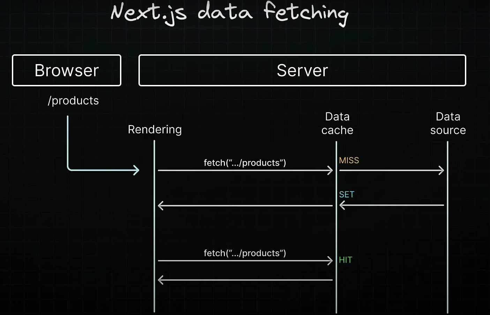

### Caching Data
- By default, `Next.js` **automatically caches** the returned values of fetch in the Data Cache on the server

### Data Cache
#### What is data cache?
- it is a server-side cache that persists the result of data fetches across incoming server requests and deployments

#### Why is it required?
- improves app performance and reduces costs by eliminating the need to re-fetch data from the data source with every request

#### How does it work?

---
### Opting Out Of Caching
1. For individual data fetches, set the `cache` option to `no-store`;  global setting - `export const fetchCache = "default-cache"`
2. Once you specify the no-store option for a fetch request, subsequent fetch requests will also not be cached
3. Before dynamic functions (`cookies()`, `headers()`, `searchParams()`), Next.js caches `fetch()` requests by default, while it will not cach after them