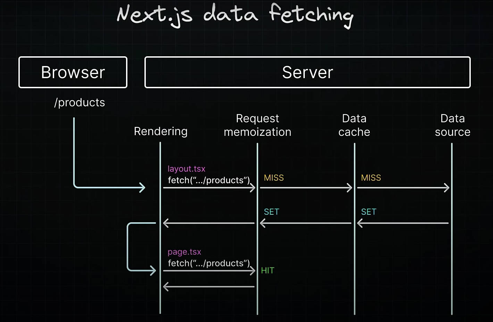

### Request Memoization
- A technique that **deduplicates requests** for the same data within a single render pass
- Allow for **re-use of data** in a **React Component tree**, prevents redundant network calls and enhances performance
- For the **initial request**, data is fetched from an external source and the result is **stored in memory**
- **Subsequent** requests for the **same data** within the **same render pass** retrieve the result from **memory**, bypassing the need to make the request again
- It eliminates the need to fetch data at the top of the tree and **pass props** between components when the same data is needed across **different components in a route**

- Request Memoization is a **React feature**, not specifically a Next.js feature, not default enabled in React 19
- Only applies to the GET methods
- Only applies with the React Component tree, it does not extend to fetch requests in **Route Handlers**